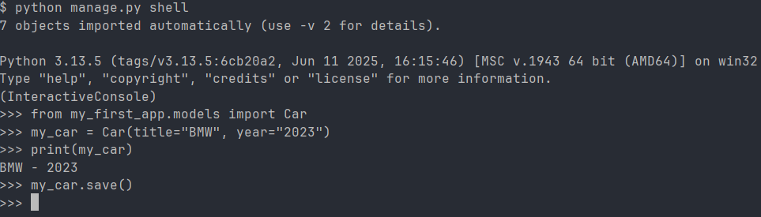

# 🚀 Proyecto Django -- Aprendizaje

Este es un proyecto desarrollado con **Django** con el objetivo de
aprender y practicar los conceptos fundamentales del framework:
estructura de aplicaciones, modelos, vistas, migraciones y uso de la
shell interactiva.

------------------------------------------------------------------------

## 📌 Objetivo del Proyecto

El propósito de este proyecto es:

- Familiarizarse con la estructura base de Django.\
- Crear y manejar aplicaciones dentro de un proyecto.\
- Trabajar con modelos, migraciones y consultas.\
- Practicar el uso de herramientas internas como `shell` y `dbshell`.

------------------------------------------------------------------------

## 🛠️ Comandos útiles de Django

### 📂 Crear una aplicación

Crea una nueva app dentro del proyecto:

``` bash
python manage.py startapp <nombre_app>
```

### 🧱 Aplicar migraciones existentes

Ejecuta todas las migraciones pendientes:

``` bash
python manage.py migrate
```

### 🏗️ Crear nuevas migraciones

Genera archivos de migración según los cambios en los modelos:

``` bash
python manage.py makemigrations
```

### Ver las migraciones

```bash
python manage.py showmigrations 
```

### 🗄️ Acceder a la base de datos

Abre la consola de la base de datos configurada:

``` bash
python manage.py dbshell
```

### 🐍 Abrir la shell interactiva

Permite ejecutar código Django directamente:

``` bash
python manage.py shell
```



------------------------------------------------------------------------

## 📚 Notas

Este proyecto es únicamente para fines educativos, con el objetivo de
entender cómo funciona Django desde cero.
